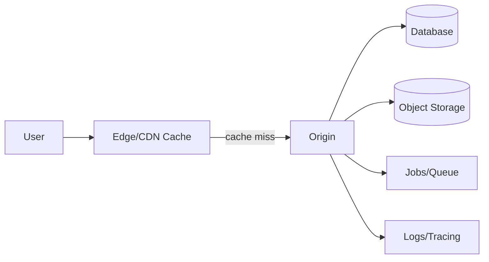

  

  <a href="https://static.bio">static.bio</a> ·
  <a href="https://static.bio/chao">My static.bio page</a> ·
  <a href="https://github.com/harry-david-brown?tab=repositories">Repos</a>

---

## Flagship (actively building)

### static.bio — static, zero-JS link-in-bio pages for devs
A performance/privacy-first “link in bio” product: compiled HTML, no public-page JavaScript, no tracking cookies, and a pay-once lifetime option.

- Live: https://static.bio
- Repo: private
- Why it exists: ownership + speed + clarity (no funnels, no bloat)

**Receipts (public engineering notes):**  
https://github.com/harry-david-brown/static-bio-engineering-notes

### Architecture (high level)

---

## Other work (side projects + coursework)

- **SnackTrackAPI** — backend work (caching, load/perf testing, observability, CI/CD)  
  https://github.com/harry-david-brown/SnackTrackAPI

- **SnackTrackApp** — companion client  
  https://github.com/harry-david-brown/SnackTrackApp

- **QNX Metronome** — RTOS message passing + resource manager  
  https://github.com/harry-david-brown/QNX-metronome

- **Monaco-Compiler** — scanner/parser/compile frontend (C)  
  https://github.com/harry-david-brown/Monaco-Compiler

---
